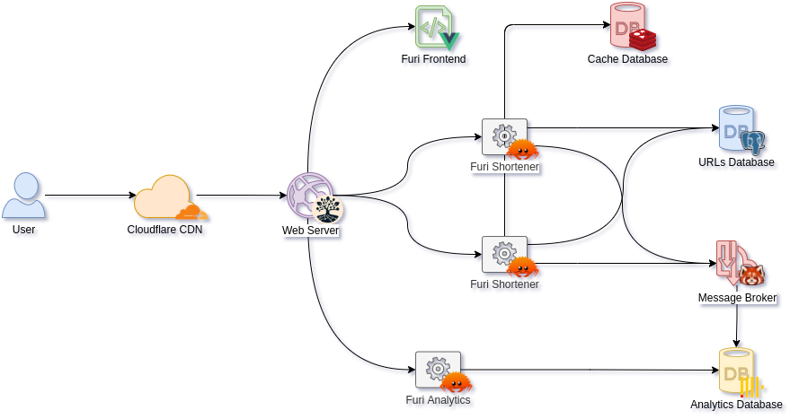

# 🦀 Furi 🦀

<p align="center">
    
</p>

A **F**ast way to generate a short **URI**, in others words, it's an URL shortener.

Designed with a high scalability and performance architecture, Furi is a straightforward URL shortener with integrated analytics.

## 🏗️ Architecture

<p align="center">
    
</p>

The first layer of access is a CDN platform, in this case, [Cloudflare](https://www.cloudflare.com/). The major reason for using a CDN is security (e.g., WAF), but the frontend static content can also be cached, improving the performance of the website.

After that, the access is sent to a [Web Server](./web-server/). Its responsibilities include serving the frontend static files, acting as a load balancer for the N instances of the Shortener API (in this case, 2 instances), and proxying access to the Analytics API.

The [Shortener API](./furi/) creates and stores the short and original URLs into database (a SQL-like database) and uses a cache layer (key-value database) to improve response performance.

When a user accesses a short URL, metrics are collected from the user and sent to a message broker to be stored in the analytics database.

The [Analytics API](./analytics/) provides the frontend with the user metrics collected when a short URL is accessed. Basically, each short URL has its own user metrics.

The project uses a simple architecture that can be scaled horizontally easily. To scale the process of accessing and shortening URLs, just instantiate more instances of the Shortener API and add them to the load balancer.

More details about each layer of the project can be found in the respective directory.

## 🔬 Tecnologies

The technologies that this project uses or has been written in are:

- [Shortener API](./furi/): [Rust](https://www.rust-lang.org/)
- [Analytics API](./analytics/): [Rust](https://www.rust-lang.org/)
- [FrontEnd](./frontend/): [Vue.js](https://vuejs.org/)
- [Web Server](./web-server/): [Jequi](https://github.com/Termack/jequi)
- Cache Database: [Redis](https://redis.io/)
- URLs Database: [Postgres](https://www.postgresql.org/)
- Analytics Database: [Clickhouse](https://clickhouse.com/)
- Message Broker: [Redpanda](https://redpanda.com/)
- CDN: [Cloudflare](https://www.cloudflare.com)

## 🏃‍♂️ Running Local

Clone the repository.
```sh
git clone git@github.com:Mewbi/furi.git
```

Set every required configuration and environment file. (Remember to edit the file content)
```sh
cp .env-example .env # Database config
cp ./furi/config-example.toml ./furi/config.prod.toml # Furi API config
cp ./frontend/.env-example ./frontend/.env # Frontend config
```

Generate SSL certificates and place them into the [certs](./certs/) directory. If you are using the default web server configuration, the certificate files must be named `furi-cert.pem` and `furi-key.key`. For more details about this, refer to the [certs](./certs/) directory.

Set the GeoIP database files into the [geoip](./furi/geoip/) directory. The project uses the [MaxMind](https://www.maxmind.com/en/home) GeoIP database, and the default filenames expected are `GeoLite2-City.mmdb` and `GeoLite2-Country.mmdb`. If your files have different names, you can change the Furi config file to match the correct database names. For more details about the GeoIP database, refer to the [geoip](./furi/geoip/) directory.

Then start all services using Docker Compose:
```sh
docker compose up -d
```

The web server will start by default in port `8443`.

A tip is edit your `/etc/hosts` to point every service hostname to your localhost, so you can simulate access using the domain name like:

```
127.0.0.1 redpanda redis postgres clickhouse furi.live www.furi.live
```

### 🛠️ Useful Tools

To access the `clickhouse`, execute

```sh
docker exec -it furi_clickhouse clickhouse-client
```

To access the `postgres`, execute

```sh
docker exec -it furi_postgres psql -U <user> -d <database>
```

It is possible to manually send data to a `redpanda` topic using `kafkacat`:

```sh
echo '{"key":"key1", "value":"value1"}' | kafkacat -b redpanda:9092 -t my-topic -P
``` 

To consume a `redpanda` topic from beginning
```sh
kcat -b redpanda:9092 -t my-topic -C -o beginning
```

## 🤝 Contributing

Furi is an open-source project, so contributions are welcome!

Feel free to share suggestions for new features, improvements, and bug fixes.
